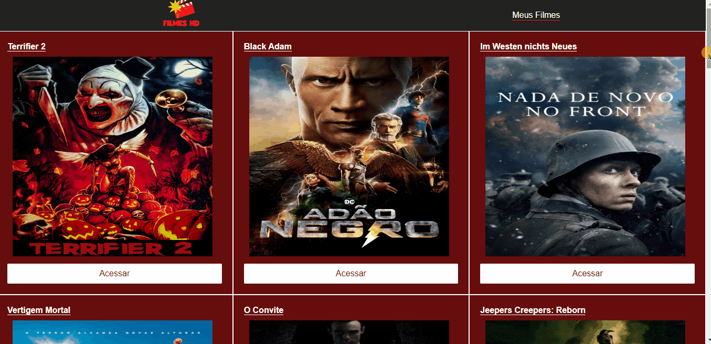

# 🎞 Filmes HD

##  📌 Explicando Projeto
    Consumo da API do theMovieDB, para criação de site
    de filmes,podendo favoritas e ver seus trailer,
    para saber mais sobre a API entre no site : https://www.themoviedb.org/?language=pt-BR

# ⚡ Tecnologias usadas:

    • Sass

    • Axios

    • react-icos

# ⚡ Api usada
    ## ThemovieDB
     

# 🚀 Rodando o projeto
Para rodar o repositório é necessário clonar o mesmo, dar o seguinte comando para iniciar o projeto:

### `git clone (projeto)`
### `npm init` or yarn

# O que será implementado na próxima sprint?
     # Inserir lixeira para excluir favoritos

### Projeto finalizado!

 # 🎯 Status do projeto - 90% completo

 

